# How AI Response Systems Work: Comprehensive Diagrams

## 1. AI System Overview

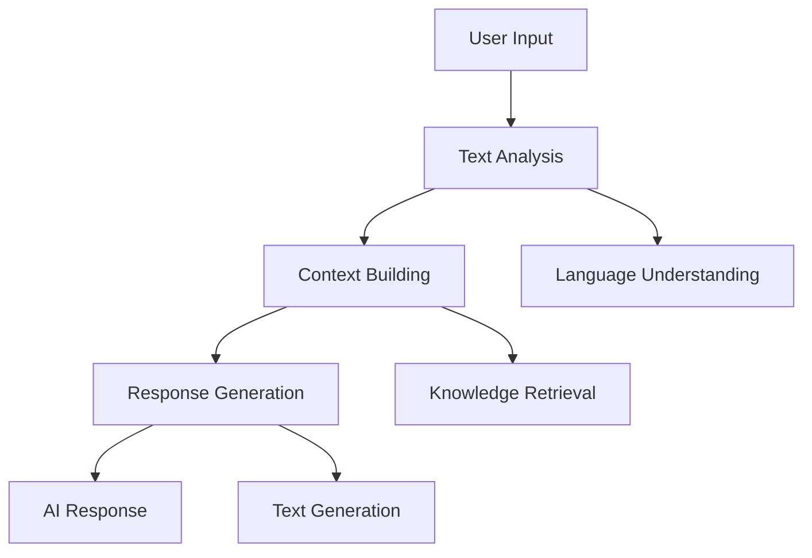

## 2. Core AI Building Blocks

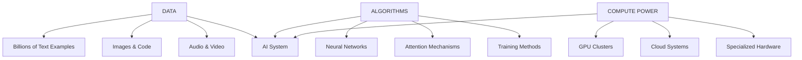

## 3. Neural Network Architecture

### Basic Neural Network Structure
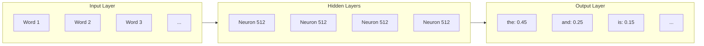

## 4. Transformer Architecture

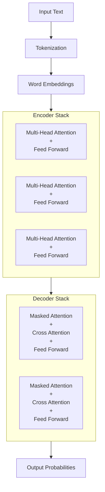

## 5. Attention Mechanism

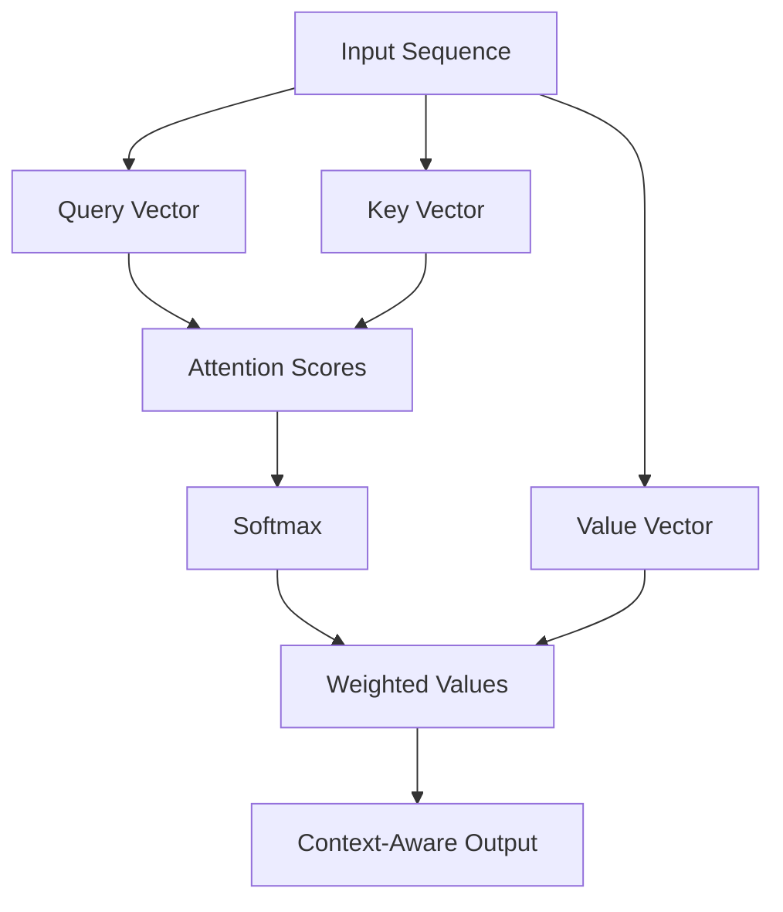

## 6. Training Process Flow

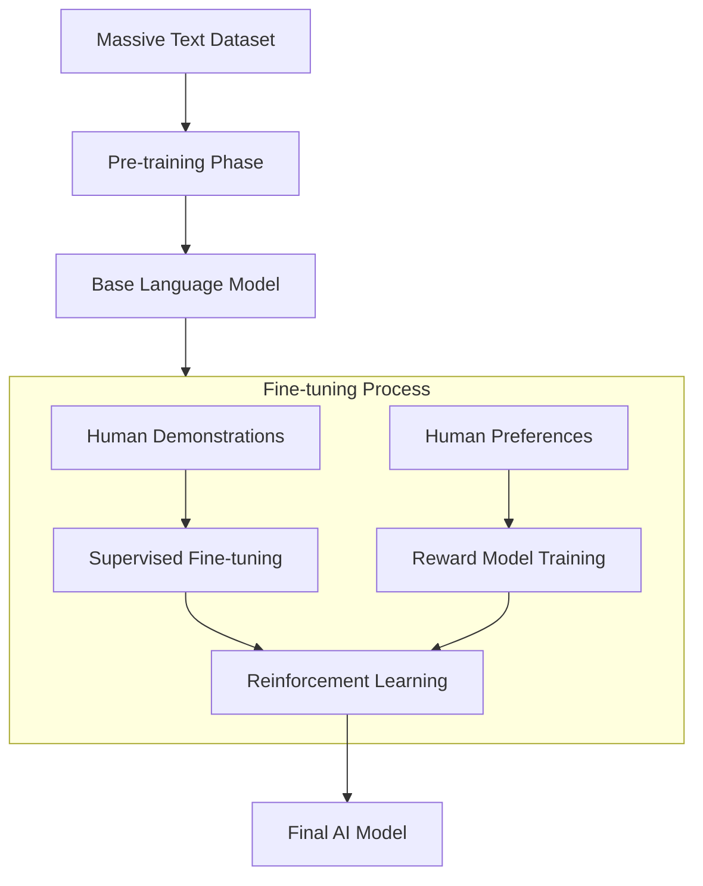

## 7. Response Generation Pipeline

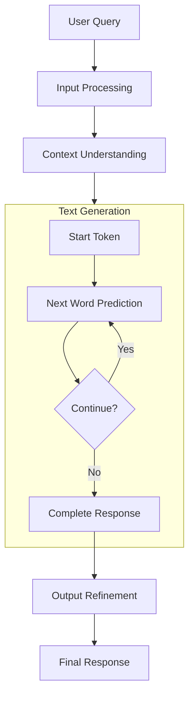

## 8. Multi-Head Attention

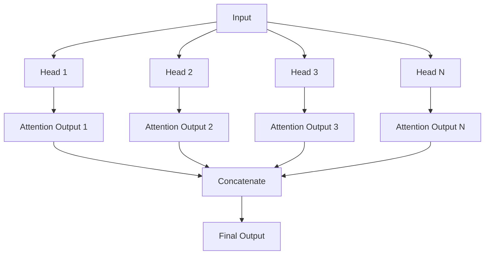

## 9. Model Scaling

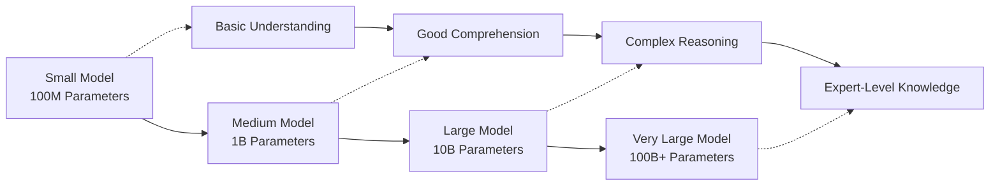

## 10. AI Response Quality Factors

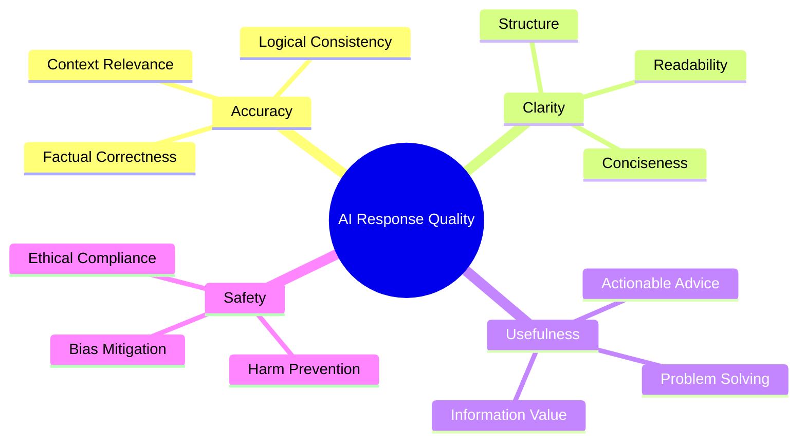

## 11. Knowledge Processing

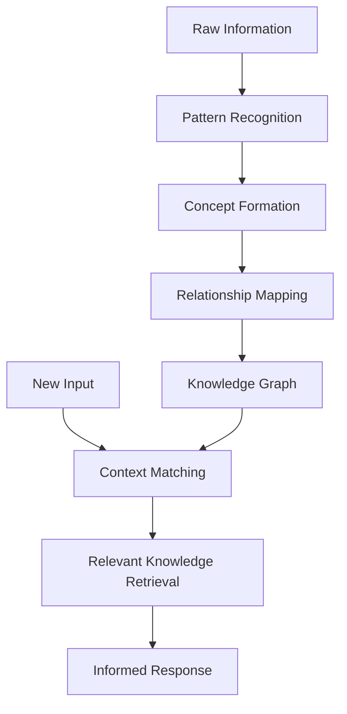

## 12. Error Correction Mechanism

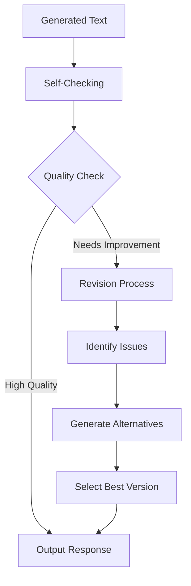

These diagrams illustrate the complex architecture and processes that enable AI systems to understand and generate human-like responses. Each component works together to transform input queries into meaningful, context-aware answers.
